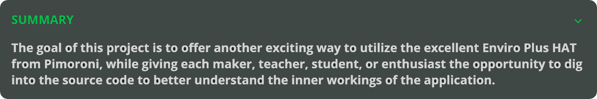

# 🌐 Enviro-Web


-%23A22846?style=plastic&logo=raspberrypi&logoColor=red&logoSize=auto)

<br>

<div align="center">
    
</div>

<br>

<div align="center">
    
</div>

<br>

## 💡 Project Rationale
The various walkthroughs and code examples provided by Pimoroni are an outstanding way for educators and makers alike to get started
quickly using boards such as the Enviro Plus HAT, but what about next steps? What are the steps needed to go beyond command line 
scripts, and on to more UI-based applications? That's usually up to the maker to figure out since each scenario is different. 


### What's better than having to figure out these steps? How about having a next-level application like this to learn from!

<br>

> **NOTE:** This project is intended to run on a Raspberry Pi to be displayed either on an attached display or monitor. 
> 
> **If you're looking for a way to view the dashboard on a separate device instead, check out our `Enviro-Desktop` project!**

<br>

## 🏗️ Building Blocks

This project utilizes `React` for handling the frontend user interface. Instead of using `NodeJS` for developing and testing (as was the case in the first version of this project), this release utilizes the blazing fast and powerful `Bun - Vite` framework combo. 

The other major change to this version of the dashboard application involves the separation of API functionality into it's own dedicated repository. Instead of a basic `Flask` micro-server, I decided to take advantage of the power and flexibility of `GraphQL` to handle all sensor queries.

It made sense to create a dedicated utility for this purpose, as it allows us and other developers to include the `GraphQL` backend as a _submodule_ in multiple different projects which all require the same API functionality. You can find the code for our **`Enviroplus-QL`** backend [here](https://www.github.com/dedsyn4ps3/Enviroplus-QL).

<br>

<div align="center">
    
</div>

<br>

## ⚡ Quick Start

- Make sure you have already gone through the setup process for the enviroplus-python repo install (**see below**)
- Follow a few quick steps to install the current LTS version of Bun
- **`git clone https://gitlab.com/dedSyn4ps3/enviro-web.git && cd enviro-web`**
- Pull down and initialize the backend submodule: **`git submodule update --init --recursive`**
- **`chmod +x backend/setup.sh start.sh`**
- **`./backend/setup.sh`** to setup dependencies
- **`./start.sh`** to run a small script to get everything up and running!
- **Open a browser on your Pi and visit <a href="http://localhost:8081">http://localhost:8081</a>**

<br>

> **Note:** Keep in mind that the secondary dashboard is primarily meant to display an additional dashboard that you may be hosting locally as well. You can certainly use a URL for a website or other web-based dashboard, but be sure to keep in mind that **most websites will have a `sameorigin` policy for their page.** This typically causes the page to not render...
>
> **Don't freak out, we've got you!** We'll be adding a section to our documentation with a simple example of a small `NodeJS` proxy application, which can query the webpage on behalf of the dashboard, allowing it to display without issue.

<br>

## 🚀 Enviro+ Setup

```bash
curl -sSL https://get.pimoroni.com/enviroplus | bash
```

### Alternative -> Install and Configure from GitHub

- **`git clone https://github.com/pimoroni/enviroplus-python`**
- **`cd enviroplus-python`**
- **`sudo ./install.sh`**

<br>

> **Note:** Raspbian/Raspberry Pi OS Lite users may first need to install **`git`** by running **`sudo apt update && sudo apt -y install git`**

<br>

## 📚 Resources
- **Learning Guides - https://learn.pimoroni.com/**
- **Support Forums - https://forums.pimoroni.com/c/support**
- **Creative Tim - https://demos.creative-tim.com/**

<br>

 > **If you have questions or would like more info on how to set up your project, feel free to [reach out](mailto:support@nullsecurity.tech)!**

<br>

## ⚖️ Licensing

**See `LICENSE.md` for details**

> ### This project includes CSS styles and Sidebar Navigation component designed by Creative Tim

*Any use, re-use, and adaptations of this project and it's code shall include the above license as well as credit for the components used that were adapted from Creative Tim's work...*

- **Copyright 2025 Creative Tim (https://www.creative-tim.com)**
- **Licensed under MIT (https://github.com/creativetimofficial/now-ui-dashboard-react/blob/main/LICENSE.md)**
